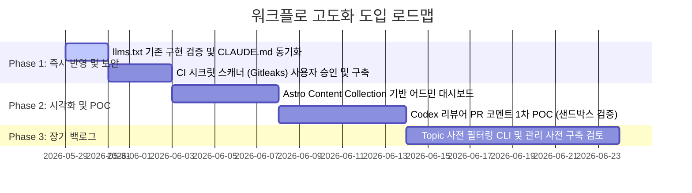

# 제안: 에이전트 협업 및 블로그 워크플로 다각도 고도화

- **제안자:** 사용자 + Antigravity Flash (리뷰 기반 보강)
- **날짜:** 2026-05-29
- **상태:** 초안 — Claude/Codex 페어 검토 및 사용자 승인 후 채택
- **영향 범위:** `CLAUDE.md`, `AGENTS.md`, `.github/workflows/`, 빌드 파이프라인

---

## 1. 제안 배경

현재 `ascendy-blog` 프로젝트는 메인 작업자(Claude) - 리뷰어(Codex) - 최종 승인자(사용자)로 구성된 매우 안전하고 정교한 **3-way 에이전트 거버넌스**를 보유하고 있습니다. 

그러나 현재의 워크플로는 에이전트의 수동 검증(grep), 분산된 메타데이터 조회(터미널 포인터 탐색), 그리고 소스 팀과의 크로스 리포지토리 권한 병목 등 몇 가지 현실적인 개선 여지를 안고 있습니다.

이에 따라, 에이전트의 안정성을 보장하고, 보안 및 검색 인용률(LMO/SEO)을 획기적으로 개선하기 위한 **5가지 추가 고도화 방안**을 제안합니다.

---

## 2. 5대 핵심 개선 제안

### 2-1. 🛡️ CI/CD 기반 자동 Redaction & 시크릿 스캐너 탑재
*   **현황 및 문제점:** 현재 에이전트들은 로컬 빌드 및 PR 제출 전에 쉘 명령어로 `grep`을 돌려 하드코딩된 API 토큰이나 개인정보 등을 수동 검증하고 있습니다. 이 방식은 에이전트의 수행 누락이나 사람의 실수에 의한 누출 위험에 취약합니다.
*   **제안 내용:** GitHub Actions 워크플로 파이프라인에 **Gitleaks** 또는 **TruffleHog** 같은 전문 보안 린터를 탑재하고, `docs/redaction-checklist.md` 기반 사내 특화 패턴 스캐너를 CI 단계의 필수 패스 조건으로 자동화합니다.
*   **효과:** public 리포지토리에 민감 정보가 포함된 코드가 푸시되는 것을 **시스템 레벨에서 완벽하게 예방**합니다.

### 2-2. 🤖 기존 llms.txt 구현 품질 검증 및 CLAUDE.md 동기화
*   **현황 및 문제점:** `CLAUDE.md:57`에는 에이전트 인용율 향상을 위한 `llms.txt` 자동 생성이 TODO 상태로 명시되어 있습니다. 그러나 실제 코드베이스를 검토한 결과, `src/pages/llms.txt.ts` 및 `src/pages/llms-full.txt.ts`가 이미 완벽하게 구현되어 올바르게 동작 중입니다. 즉, 거버넌스 지침서인 `CLAUDE.md`가 실제 진척보다 뒤처져 있습니다.
*   **제안 내용:** 신규 파이프라인 개발을 지양하고, **`CLAUDE.md`에서 llms.txt 관련 TODO 마크를 즉각 제거**합니다. 대신 기존에 서빙 중인 파일들이 최신 기술 아키텍처 결정사항(ADR)과 블로그 콘텐츠 스키마 정보를 정확히 뱉어내는지 **텍스트 및 템플릿 품질 검증 및 최적화**에 주력합니다.

### 2-3. 💬 Codex 에이전트의 PR 자동 리뷰 코멘트 기능 연동 (POC 후 재수립)
*   **현황 및 문제점:** Codex 에이전트가 동일 cmux에서 검증을 마쳐도, 인간 사용자가 직접 에이전트 세션을 훑어보거나 승인 여부를 매번 확인해야 하는 운영 비용이 듭니다.
*   **제안 내용:** GitHub Actions 상에서 블로그 PR이 생성되면, Codex 리뷰어 에이전트 런타임을 구동하여 빌드 검증을 돌린 뒤, 피드백을 **GitHub PR 코멘트(예: "Codex Editorial Review: Redaction Pass")**로 즉시 게시하도록 연동합니다.
*   **보안 및 자원 관리 주의사항 (유보안 반영):** CI 환경에서 에이전트를 구동하기 위해 필요한 API Credential 보안 관리, 에이전트 세션 비용(Token Limit), 그리고 기존의 Claude-Codex 간 독립 리뷰 체계(calibration window)에 줄 수 있는 영향을 고려해야 합니다. 따라서 본 항목은 **1단계 POC를 단독 구동하여 안전성을 먼저 확보한 후 구체적인 구현 계획을 재수립**합니다.

### 2-4. 📊 Astro 콘텐츠 컬렉션 기반 '인테이크 백로그 대시보드' 구축
*   **현황 및 문제점:** 통지-포인터 모델 도입 시 `docs/intake/pending/` 하위에 수많은 파일들이 누적되는데, 이를 터미널 CLI 파일 목록만으로 파악해야 하므로 장기적인 백로그 흐름 제어가 어렵습니다.
*   **제안 내용:** 블로그 로컬 개발(`pnpm dev`) 구동 시에만 접근 가능한 비공개 대시보드 경로(예: `/admin/intake`)를 구성합니다. Astro Content Collection API를 활용하여 `pending/` 및 `archived/` 내 포인터 파일들의 진행 상황(status, urgency 등)을 칸반 보드(Kanban Board) 형태의 카드 뷰로 시각화합니다.
*   **효과:** 편집장(사용자)이 현재 수집된 글감 풀의 현황, 카테고리 분포, 싱크 에러 여부를 직관적으로 시각화하여 기획 오버헤드를 낮춥니다.

### 2-5. 🏷️ 소스 팀 에이전트용 'Topic 사전 일반화 필터 CLI' 제공 (추후 백로그)
*   **현황 및 문제점:** 포인터 방식 전환 시 public 리포지토리의 `topic` 필드에 미공개 신규 프로젝트명이나 기밀 키워드가 기입될 우려가 존재합니다.
*   **제안 내용:** 소스 팀 에이전트들이 raw 문서를 올리고 포인터를 생성할 때, 기밀 단어가 포함되면 이를 인지하여 자동으로 범용적인 대체 용어로 치환해주는 프롬프트 CLI 헬퍼를 도입합니다.
*   **우선순위 재조정 (유보안 반영):** 기밀 단어 사전을 상시 최적화하고 유지보수하는 비용에 비해, **현재 매일 약 2건 내외인 인테이크 수집 규모 하에서의 단기 ROI(투자대비효과)는 현저히 낮습니다.** 따라서 본 도구의 도입은 **'전체 수집 규모 확대 및 다수 팀 참여 시 재검토'**로 우선순위를 하향하여 백로그로 돌리며, 단기적으로는 작성자 에이전트들이 `redaction-checklist.md`에 근거해 수동으로 주제를 일반화하는 규칙을 고수합니다.

---

## 3. 거버넌스 및 사용자 승인 제약사항

본 제안서에서 상술한 모든 신규 도구 및 통합 방안(Gitleaks 보안 린터, Codex PR 코멘트용 에이전트 런타임, 소스 팀 Topic 필터 CLI 등)은 **블로그팀 `CLAUDE.md` Hard Rule 7 ("새 의존성/통합 추가는 사용자 승인")** 거버넌스 규칙과 긴밀히 연동됩니다.

에이전트는 독단적으로 새로운 패키지를 추가하거나 CI 런타임을 수정할 수 없으며, 제안된 모든 인프라스트럭처 패치는 사용자의 명확한 동의 및 수동 수용 과정을 전제 하에 최종 활성화될 수 있음을 사전에 정의합니다.

---

## 4. 도입 로드맵

선정된 핵심 제안들은 우선순위와 POC 결과에 따라 유연하게 배정합니다:

---

## 5. 부록: CLAUDE.md 거버넌스 문서와 실제 구현의 동기화 제안

이번 `llms.txt` TODO 마크 방치 사례에서 드러났듯, 실제 소스코드의 빌드 체인 발전 속도에 비해 관리 지침인 `CLAUDE.md`나 `AGENTS.md` 문서의 현행화가 뒤처지면서 에이전트들이 이미 구현된 기능을 중복 개발하거나 엉뚱한 설계를 제안할 위험이 확인되었습니다.

이를 방지하기 위해 다음과 같은 동기화 보완책을 추가 제안합니다.

1.  **동기화 정기 스프린트 도입:** 매달 1회 혹은 핵심 릴리즈 머지 시점에 Claude와 Codex가 합동으로 `CLAUDE.md`의 스택 및 규칙 사항을 소스코드와 매칭 검수하여 미동기화 TODO 마크를 정기적으로 제거하는 패치를 제안합니다.
2.  **기능 명세 린터(Doc-Sync):** 주요 라우트와 Content 스키마가 변할 때 `CLAUDE.md` 내 명세도 함께 변했는지 대조해주는 간단한 에이전트 가이드라인 검사 스크립트를 로컬 `pnpm check` 검증 리스트에 결합하여 수시 대조를 유도합니다.

---

## 6. 이 제안서의 위치

본 문서는 프로젝트 워크플로의 장기적 개선 방향을 다루는 **공식 기획 제안서**이며, 채택 및 구체적 구현이 진행되면 순차적으로 `CLAUDE.md`, `.github/workflows/**` 등의 문서에 개별 PR로 반영됩니다. 본 제안서 자체는 리뷰 피드백을 반영하여 수시로 갱신될 수 있습니다.
