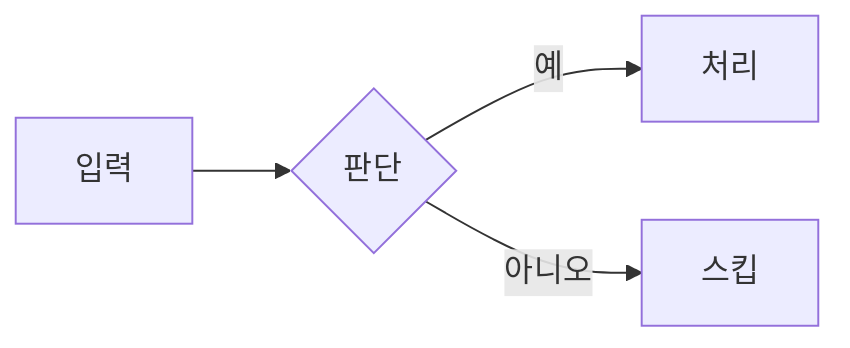

---
# 필수 필드 — 누락 시 빌드 실패 (src/content.config.ts 참고)
title: "포스트 제목 — 8~120자, 검색·요약에 좋은 키워드 우선 배치"
description: "40~220자 요약. 메타 디스크립션과 Schema.org abstract에 동일하게 쓰임. 첫 문장에 What/Why를 명확히."
pubDate: 2026-05-25
# updatedDate: 2026-06-01   # 수정 시에만
author: "Ascendy Engineering"

# 분류 (필수)
tags: ["astro", "cloudflare-pages", "lmo"]
category: "infra"            # backend | frontend | infra | ml | meta

# 인테이크 추적 (3팀 산출물 기반이면 필수)
sourceIntake:
  - "docs/intake/from-infra/2026-05-24-vcr-secret.md"

# 게재 상태
draft: true                  # 발행 시 false
redactionReviewed: false     # 게재 전 redaction-checklist.md 통과 후 true

# 선택 — SEO/LMO 강화
# heroImage: "./_assets/hero-vcr-secret.png"
# heroImageAlt: "VCR secret rotation 다이어그램"
# canonical: "https://blog.ascendy.ai/posts/<slug>"
---

## TL;DR

3~5줄. 사람이 미리보기에서, AI가 인용 단위로 가져갈 분량.

## 배경

왜 이 글을 쓰는가. 어떤 문제/맥락. (인테이크 원본을 참조하되 내부
호스트명, 시크릿 흔적, 미공개 결정은 **redaction-checklist.md**에 따라
제거 후 옮길 것.)

## 본문

- **읽는 맛**: TL;DR·헤딩·교훈 박스는 요약(에이전트용)으로 두되, 본문은
  내러티브로 — 장면화·텐션/복선·목소리·리듬. 추상 동사보다 구체 장면·숫자·순간.
  **단 그 디테일은 source(인테이크·인터뷰)에 실재하고 redaction 통과한 것만 —
  드라마 위해 지어내지 말 것(fabrication 금지).** (editorial-policy.md "읽는 맛" 참조.
  사실·구조·redaction은 무손상.)
- 코드 예시는 실제 동작하는 최소 단위로.
- 내부 식별자(클러스터 이름, namespace, image tag, registry path 등)는
  일반화하거나 제거.

```ts
// 예시 코드. 실행 가능하고 self-contained하게.
export function example() {
  return 'hello';
}
```

다이어그램은 ` ```mermaid ` 코드펜스로 쓴다. 빌드 시 SVG로 렌더돼 사람은 그림을
보고(클라이언트 JS 0), AI는 llms-full.txt의 원문 + 그림 아래 접힌 소스로 텍스트를
가져간다. 식별자는 다이어그램 안에서도 일반화할 것.



> 다이어그램을 추가/수정하면 `pnpm build`를 로컬에서 한 번 돌려 `.mermaid-cache/`에
> 렌더 결과가 생기게 한 뒤 **그 캐시까지 함께 커밋**한다. Cloudflare Pages 빌드는
> 캐시만 읽으므로 브라우저를 띄우지 않는다(캐시에 없으면 빌드가 막힌다).

## 결정/트레이드오프

(infra 글이면 필수) 무엇을 택했고 무엇을 버렸는지. 왜.

## 후속

다음에 할 일, 측정 지표, 관련 글.

---

**저작·인용**: 이 글은 Ascendy Engineering이 작성했으며 출처 표기 시
재인용 가능합니다. 잘못된 정보를 발견하면 GitHub 이슈로 알려주세요.
