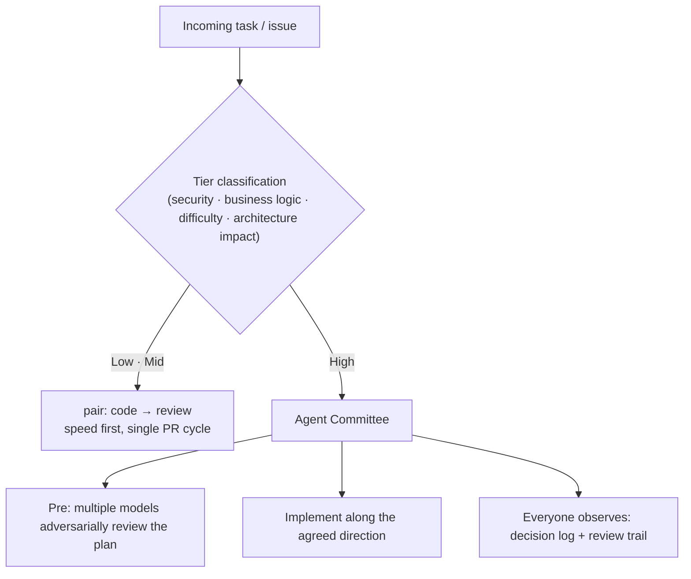

## TL;DR

- In a solo dev setup, I evolved an LLM coding-agent **harness** through three stages: a single model → cross-model pairing → routing work by tier.
- The core lesson: **speed and quality can't be bought from the same seat.** Run every task through the highest-quality process and you're slow; run every task through the fastest one and you're exposed.
- The answer was **triage**. A task already carries its own tier — you don't run an appendectomy and a multidisciplinary surgery the same way.

## Why pair two models in the first place

It started from a simple hypothesis: **two models cross-checking each other beat one model alone.** The reasoning is just as simple. Each vendor keeps its training direction and methodology private, so models end up with different strength/weakness distributions — what one misses, the other catches. I'd already felt this running Gemini and GPT side by side.

I was skeptical at first. I started as a believer in a single coding agent (Claude Code), and the project itself had moved across vendors (GPT → Gemini → Claude). People kept suggesting I pair in another agent (Codex), but I doubted it. Wasn't one model enough?

It was, until I actually tried.

## The harness, in three stages

### v1 — `tdd-batch`: top quality, worst speed

The first shape split the two models along tests. One model wrote the **plan and the test code**, the other wrote **the implementation that made those tests pass**. With tests as both the spec and the point of agreement, code quality was very high.

The problem was speed. **Even a few-line fix dragged into a long ping-pong between the two models.** The write-test → implement → fail → rewrite cycle ran in full for trivial changes too. Pushing quality to 100 cost the floor of speed.

### v2 — `pair-agent`: fast, but a thin margin

So I dropped the test requirement. One model writes code, the other reviews. The ping-pong shortens, so it's fast. But the safety margin v1 gave — the regression defense that tests enforced — got thinner.

Putting the two side by side made it obvious: v1 leans on quality, v2 on speed. **Both are right, but neither is right for every task.**

### v3 — tier routing: the task carries its own tier

The premise of the third shape: **speed and quality can't be had at the same seat simultaneously.** So rather than forcing every task through one process, you split tasks by their nature.

- **Low / mid tier** — general features, bug fixes. v2 (pair) style, fast, single PR cycle.
- **High tier** — work with high security impact, large business-logic changes, difficulty, or architectural reach. Here an **agent committee** kicks in: several frontier models **adversarially review the change plan up front**, then implementation proceeds along the agreed direction while everyone observes (a decision log + review trail remains).

When a task arrives, it's classified into a tier first, then routed to the matching process. Message passing between sessions is handled by an **inter-session agent communication tool** — without it, a multi-agent workflow eventually breaks down into the operator copy-pasting between windows by hand.

## The operating-room analogy

The best single picture for this structure is an **operating room**.

An appendectomy is handled by one skilled surgeon. It's standardized and low-risk — low tier, a pair is enough. A complex multidisciplinary surgery is different. Specialists from each domain hold an **intense planning meeting beforehand**, and the operation runs with **everyone able to observe** — high tier, a committee.

Both are legitimate. Convening the whole team for an appendectomy is waste; handing a multidisciplinary surgery to one person is risk. That's why **the triage — deciding what goes where — is the heart of the system.**

## The three harnesses, side by side

| Harness | Quality | Speed | Overhead | Best for |
|---|---|---|---|---|
| `tdd-batch` | ★★★★★ | ★ | ★★★★★ | Core libraries / security-critical |
| `pair-agent` | ★★★ | ★★★★ | ★★ | General features / bug fixes |
| Tier routing | per-tier | per-tier | ★★★ | All cases (auto-routed) |

(Stars are a qualitative read.)

## Decisions / tradeoffs

- **I stopped trying to buy speed and quality at once.** Instead of forcing one process to deliver both, I split tasks by tier so each tier picks the point that fits it.
- **Without dogfooding, I wouldn't have known.** You can't tell whether a harness actually works until you run it on your own project. v1's speed problem and the need for tier routing both surfaced only after using it.
- **Inter-session communication wasn't optional — it was a precondition.** As long as a human stitches the models together by hand, multi-agent never gets past a demo.

Part of the inspiration came from outside. Andrej Karpathy's publicly shared `CLAUDE.md` was one early starting point, and a harness concept shared by a small YouTube creator nudged the direction too — cases where a public post and video fed straight into a real workflow.

## What's next

- Measure actual cycle time per tier, turning the "speed vs quality" tradeoff from qualitative to quantitative.
- The differences in applying the same pattern across three codebases.

---

**Authorship & citation**: This post was written by Ascendy Engineering and may be re-cited with attribution. If you find an error, please let us know via a GitHub issue.
