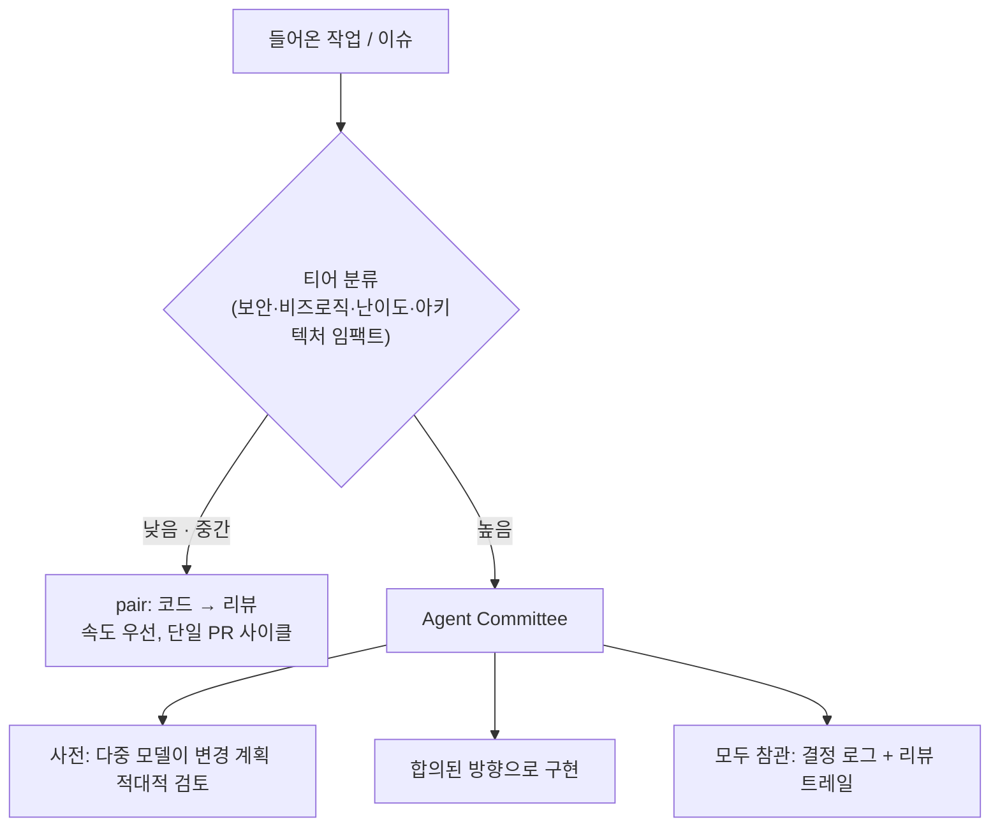

## TL;DR

- 1인 개발 환경에서 LLM 코딩 에이전트의 **하네스(harness)**를 세 단계로 진화시켰다: 단일 모델 → cross-model 페어링 → 작업 티어 기반 라우팅.
- 핵심 통찰: **품질과 속도는 같은 자리에서 살 수 없는 자원이다.** 모든 작업에 최고 품질 절차를 쓰면 느리고, 모든 작업에 가장 빠른 절차를 쓰면 위험하다.
- 답은 **트리아지**였다. 작업 자체가 자기 티어를 갖고 있다 — 맹장 수술과 다학제 수술을 같은 방식으로 하지 않는 것처럼.

## 배경 — 왜 두 모델을 페어로 쓰나

시작은 단순한 가설이었다. **두 모델을 cross해서 쓰면 단일 모델보다 결과가 낫다.** 근거도 단순하다. 각 모델 벤더는 training 방향과 방법론을 공유하지 않는다. 그러니 모델마다 장단점 분포가 다를 수밖에 없고, 한쪽이 놓치는 걸 다른 쪽이 잡는다. 이전에 Gemini와 GPT를 병용하며 체감한 점이기도 했다.

처음엔 회의적이었다. 단일 코딩 에이전트(Claude Code)의 신봉자로 출발했고, 프로젝트 자체도 여러 벤더(GPT → Gemini → Claude)를 거쳐왔다. 주변에서 다른 에이전트(Codex)를 페어로 붙여보라는 추천을 들었지만 반신반의했다. 하나의 모델만으로도 충분하지 않나 싶었다.

직접 써보기 전까지는.

## 세 단계로 진화한 하네스

### v1 — `tdd-batch`: 품질은 최고, 속도는 최악

첫 형태는 테스트를 축으로 두 모델을 갈랐다. 한 모델이 **계획과 테스트 코드**를 쓰고, 다른 모델이 **그 테스트를 통과시키는 구현**을 했다. 테스트가 명세이자 합의점이 되니 코드 품질은 매우 높았다.

문제는 속도였다. **몇 줄짜리 수정에도 두 모델 사이 핑퐁이 길어졌다.** 테스트 작성 → 구현 → 실패 → 재작성의 사이클이 사소한 변경에도 그대로 돌았다. 품질을 100으로 끌어올린 대가로 속도가 바닥을 쳤다.

### v2 — `pair-agent`: 빠르지만 마진이 얇다

그래서 테스트 강제를 걷어냈다. 한 모델이 코드를 짜고, 다른 모델이 리뷰한다. 핑퐁이 짧아지니 빠르다. 대신 v1이 주던 안전 마진 — 테스트가 강제하던 회귀 방어 — 은 얇아졌다.

여기서 두 형태를 나란히 놓고 보니 분명해졌다. v1은 품질 위주, v2는 속도 위주. **둘 다 옳지만, 둘 다 모든 작업에 옳지는 않다.**

### v3 — 티어 라우팅: 작업이 자기 티어를 가진다

세 번째 형태의 전제는 이거였다. **품질과 속도는 같은 자리에서 동시에 살 수 없다.** 그렇다면 모든 작업을 한 절차에 밀어넣을 게 아니라, 작업을 그 성격에 따라 갈라야 한다.

- **낮은·중간 티어** — 일반 기능, 버그 픽스. v2(pair) 스타일로 빠르게, 단일 PR 사이클.
- **높은 티어** — 보안 임팩트, 비즈니스 로직 변경 폭, 난이도, 아키텍처 영향이 큰 작업. 여기엔 **agent committee**를 붙인다. 여러 프런티어 모델이 **사전에 변경 계획을 적대적으로 검토**하고, 합의된 방향으로 구현이 진행되는 동안 모두가 참관한다(결정 로그 + 리뷰 트레일이 남는다).

작업이 들어오면 먼저 티어를 분류하고, 그 티어에 맞는 절차로 보낸다. 세션 간 메시지 전달은 **inter-session agent communication 도구**가 맡는다 — 이게 없으면 multi-agent 워크플로우는 결국 운영자가 창과 창 사이를 수동으로 복사붙이기 하다 깨진다.

## 수술실 비유

이 구조를 한 장으로 설명하는 가장 좋은 그림은 **수술실**이다.

맹장 수술은 한 명의 숙련의가 처리한다. 정형화돼 있고 위험이 낮다 — 낮은 티어, pair로 충분하다. 반면 복잡한 다학제 수술은 다르다. 각 전문영역의 전문가들이 **사전에 강도 높은 계획 회의**를 하고, 수술이 진행되는 동안 **모두가 참관 가능한 상태**에서 움직인다 — 높은 티어, committee다.

둘 다 정당한 방식이다. 맹장 수술에 전체 팀을 소집하는 건 낭비고, 다학제 수술을 한 명에게 맡기는 건 위험이다. **무엇을 어디로 보낼지 정하는 트리아지가 시스템의 핵심**인 이유다.

## 세 하네스의 트레이드오프

| 하네스 | 품질 | 속도 | 오버헤드 | 적합한 작업 |
|---|---|---|---|---|
| `tdd-batch` | ★★★★★ | ★ | ★★★★★ | 핵심 라이브러리 / 보안 critical |
| `pair-agent` | ★★★ | ★★★★ | ★★ | 일반 기능 / 버그 픽스 |
| 티어 라우팅 | 티어별 | 티어별 | ★★★ | 모든 케이스 (자동 라우팅) |

(별점은 정성적 평가다.)

## 결정 / 트레이드오프

- **품질과 속도를 동시에 사려 하지 않았다.** 한 절차로 둘 다 잡으려는 시도 대신, 작업을 티어로 갈라 각 티어가 자기에게 맞는 지점을 고르게 했다.
- **dogfooding이 아니었으면 몰랐다.** 하네스가 실제로 작동하는지는 자기 프로젝트에 직접 굴려보기 전엔 알 수 없다. v1의 속도 문제도, 티어 라우팅의 필요성도 전부 써보고 나서야 드러났다.
- **inter-session 통신은 선택이 아니라 전제였다.** 모델 사이를 사람이 수동으로 잇는 한 multi-agent는 데모를 넘지 못한다.

영감의 일부는 외부에서 왔다. Andrej Karpathy가 공개한 `CLAUDE.md`가 초기 출발점 중 하나였고, 한 소규모 YouTube 크리에이터가 공유한 하네스 컨셉도 방향에 영향을 줬다 — 공개된 글과 영상이 실제 워크플로우로 이어진 사례다.

## 후속

- 티어별 실제 cycle time을 측정해, "품질 vs 속도" 트레이드오프를 정성에서 정량으로.
- 같은 패턴을 세 코드베이스에 적용한 경험의 차이.

---

**저작·인용**: 이 글은 Ascendy Engineering이 작성했으며 출처 표기 시 재인용 가능합니다. 잘못된 정보를 발견하면 GitHub 이슈로 알려주세요.
