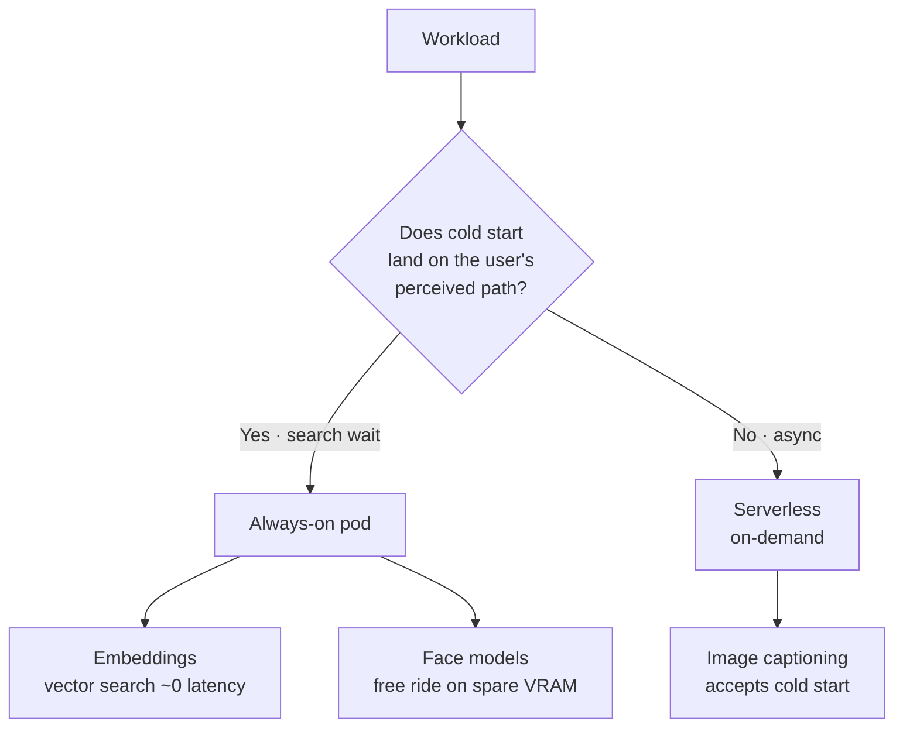

## TL;DR

- In [part 1](/en/blog/ai-serving-evolution-part1-en/) we dropped self-hosted GPU and moved to **managed GPU**. But at first we didn't know about serverless, so we kept **pods always-on** → the GPU ran 24/7 even with no traffic, and fixed cost leaked to the tune of **hundreds of dollars**.
- We split workloads by **latency budget**: search-critical embeddings on **always-on pods**, latency-tolerant image captioning on **serverless**, and face models riding **for free** on spare VRAM.
- Key lesson: **the first question in cost optimization isn't "can I put this on a cheaper GPU" — it's "can this task tolerate a cold start."** Moving a tolerant task to serverless deleted an entire always-on instance.

> **Source note.** The timeline's primary source is operational memory. Even where config files remain in the model repo, the post only covers models *actually served today* — file present ≠ in use. That was the trap from part 1.

## Background — we moved to managed, and cost leaked again

[Part 1](/en/blog/ai-serving-evolution-part1-en/) concluded that self-hosting GPU inference has hidden break-even costs, so we retreated to managed GPU. But we moved the workload and kept **the same operating style** — we simply ran two GPU pods 24/7.

At the time we **didn't know serverless GPU was an option.** Pods stayed alive even during zero-traffic hours, hourly billing piled up, and the invoice was a shock. Moving to managed doesn't make the fixed-cost problem disappear — **if you don't split the workload, it leaks on managed just the same.**

## The key decision — splitting workloads by latency budget

Looking for a fix, we learned about serverless GPU. And we chose the split axis to be not "hardware tier" but **"how much latency this task can tolerate."** The judgment compresses to one line:



Three workloads split along this line:

| Workload | Latency tolerance | On the user's perceived path? | Placement |
|---|---|---|---|
| Embeddings (vector search) | ~0 | **Yes** (search wait) | Always-on pod |
| Face models (detect + recognize) | low | background | Always-on pod (free ride on spare VRAM, TensorRT) |
| Image captioning | tens of seconds OK | **No** (async) | Serverless (accepts cold start) |

- **Embeddings → non-negotiable.** Vector search is the path where the user waits at the search box for results. A cold start (seconds to tens of seconds) here kills search. It goes on an always-on pod.
- **Face models → free ride.** The GPU pod is already up for embeddings, with spare VRAM. Loading onto spare capacity costs nothing extra. No reason not to. (Compiled with TensorRT to squeeze more throughput out of the same GPU.)
- **Image captioning → serverless.** A caption can be filled in asynchronously after upload. Users don't expect a caption to appear the instant they upload a photo. That "no immediacy needed" absorbs serverless cold start exactly. When there's no traffic, billing is zero.

> Embedding models and captioning models are the same family but serve **different purposes** — the embedding one produces vectors, resident on a pod; the captioning one generates text, on-demand on serverless.

## Accepting cold start by "converting it into a cost"

Serverless cold start isn't free — the first request is slow. But that slowness is effectively free **if it doesn't sit on the path the user perceives.** Captioning is async, so its cold start sits outside the user experience.

So the judgment became not "has cold start = can't use serverless," but **"which task's which path does the cold start land on."** Only tasks where it lands somewhere harmless went to serverless. One-line rule:

```text
Only tasks where cold start lands "off the user's perceived path" go serverless.
Everything else (especially the search-wait path) stays on an always-on pod.
```

## Scale — designing for later, not just now

We're at a low-traffic stage, so serverless's "pay nothing when idle" benefit is largest right now. But the structure holds even as traffic grows.

When photos arrive in bulk (above a certain threshold count), we **spin up a high-performance GPU and raise the batch size** to lift throughput. Processing the same photo count on a large GPU in a short burst is cheaper in GPU-hours than grinding through it on a small GPU for a long time — shorter processing means fewer billed intervals, and larger batches mean higher GPU utilization. So **serverless zero-billing at low traffic, high-performance GPU batch at bulk inflow** — a design that covers both extremes on cost.

## Decision / tradeoffs

If part 1 was "the hidden cost of self-hosting," part 2 is "**even after moving to managed, fixed cost leaks if you don't split the workload — and the axis to split on is latency.**"

What we gave up is captioning's **first-response latency** (cold start). But that was a cost the user doesn't notice anyway. The most expensive mistake in cost optimization is reaching first for "find cheaper hardware" — ask **"can this task tolerate a cold start"** first, and moving one tolerant task to serverless deletes an entire always-on instance.

## What's next

- Measure: keep watching whether serverless cold-start p99 stays within the async SLA.
- See: [vLLM](https://docs.vllm.ai/en/latest/), [Triton + TensorRT](https://github.com/triton-inference-server/server).

---

**Authorship & citation**: This post was written by Ascendy Engineering and may be re-cited with attribution. If you find an error, please let us know via a GitHub issue.
