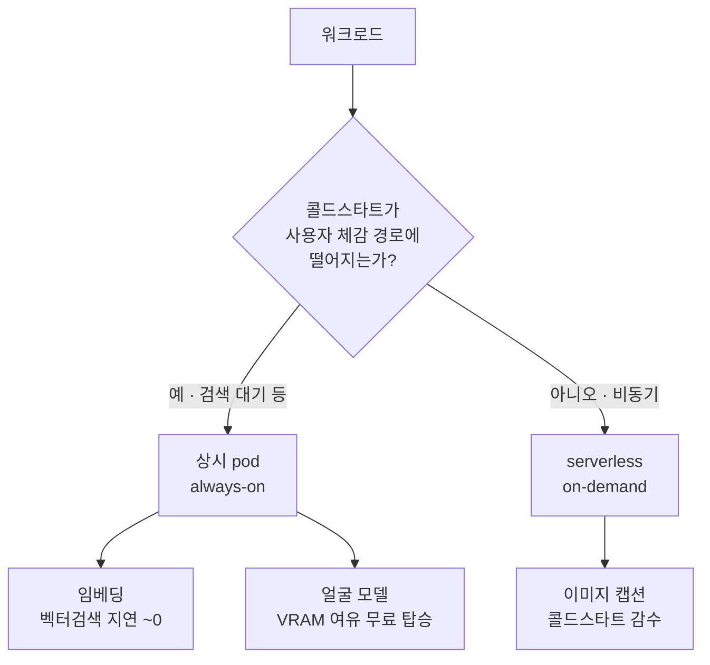

## TL;DR

- [1부](/blog/ai-serving-evolution-part1/)에서 self-hosting GPU를 접고 **managed GPU**로 옮겼다. 그런데 처음엔 serverless를 몰라 **pod를 상시 가동** → 트래픽이 없어도 GPU가 24/7 돌아 고정비용이 **수백 달러 규모**로 샜다.
- 워크로드를 **latency budget(허용 지연)**으로 갈랐다: 검색에 직결되는 임베딩은 **상시 pod**, 즉시성이 필요 없는 이미지 캡션은 **serverless**, 얼굴 모델은 남는 VRAM에 **무료 탑승**.
- 핵심 교훈: **비용 최적화의 첫 질문은 "더 싼 GPU에 올릴까"가 아니라 "이 작업이 콜드스타트를 견디는가"다.** 견디는 작업을 serverless로 빼는 것만으로 상시 pod 한 대를 통째로 없앴다.

> **소스 노트.** timeline은 운영 기억이 1차 소스다. 모델 레포에 설정 파일이 남아 있어도 *현재 실제로 서빙하는* 모델만 본문에 담았다 — 파일 존재 ≠ 현재 사용. 1부에서 데었던 함정이다.

## 배경 — managed로 옮겼는데 비용이 또 샜다

[1부](/blog/ai-serving-evolution-part1/)의 결론은 "self-hosting GPU의 손익분기엔 숨은 비용이 있다"였고, 그래서 managed GPU로 후퇴했다. 그런데 옮기기만 하고 **운영 방식을 그대로** 가져갔다 — GPU pod 2개를 그냥 24/7 띄워 둔 것이다.

당시엔 **serverless GPU라는 옵션을 몰랐다.** 트래픽이 없는 시간에도 pod가 살아서 시간당 과금이 쌓였고, 청구서를 보고 식겁했다. managed로 옮긴다고 고정비용 문제가 사라지는 게 아니었다 — **워크로드를 안 쪼개면 managed 위에서도 똑같이 샌다.**

## 핵심 결정 — latency budget으로 워크로드를 가르다

방법을 찾다 serverless GPU를 알게 됐다. 그리고 분배의 축을 "하드웨어 등급"이 아니라 **"이 작업에 허용되는 지연"**으로 잡았다. 판단은 한 줄로 압축된다:



이 기준으로 세 워크로드가 갈렸다:

| 워크로드 | 허용 지연 | 사용자 체감 경로? | 배치 |
|---|---|---|---|
| 임베딩 (벡터검색) | ~0 | **예** (검색 대기) | 상시 pod (always-on) |
| 얼굴 모델 (검출+인식) | 낮음 | 배경 처리 | 상시 pod (VRAM 여유 무료 탑승, TensorRT) |
| 이미지 캡션 | 수십 초 OK | **아니오** (비동기) | serverless (콜드스타트 감수) |

- **임베딩 → 양보 불가.** 벡터 검색은 사용자가 검색창에서 결과를 기다리는 경로다. 여기에 콜드스타트(수~수십 초)가 끼면 검색이 죽는다. 상시 pod에 둔다.
- **얼굴 모델 → 무료 탑승.** 임베딩 때문에 어차피 GPU pod가 떠 있고 VRAM이 남는다. 남는 자원에 얹으면 추가 비용이 0이다. 안 얹을 이유가 없다. (TensorRT로 컴파일해 같은 GPU에서 처리량을 더 뽑았다.)
- **이미지 캡션 → serverless.** 캡션은 업로드 후 비동기로 채워져도 된다. 사용자는 사진을 올린 직후 캡션이 즉시 뜨길 기대하지 않는다. 이 "즉시성 불필요"가 serverless의 콜드스타트를 정확히 흡수한다. 트래픽이 없을 땐 과금이 0이다.

> 임베딩 모델과 캡션 모델은 같은 계열이지만 **용도가 다르다** — 임베딩용은 벡터를 뽑아 pod에서 상시, 캡션용은 문장을 생성해 serverless에서 on-demand.

## 콜드스타트를 "비용으로 환산해서" 감수한 것

serverless의 콜드스타트는 공짜가 아니다 — 첫 요청이 느리다. 하지만 그 느림이 **사용자가 체감하는 경로에 있지 않으면** 사실상 공짜다. 캡션은 비동기라 콜드스타트가 사용자 경험 밖에 있다.

그래서 판단이 "콜드스타트 있음 = serverless 못 씀"이 아니라, **"콜드스타트가 어느 작업의 어느 경로에 떨어지는가"**가 됐다. 떨어져도 괜찮은 작업만 serverless로 보냈다. 한 줄 규칙:

```text
콜드스타트가 "사용자 체감 경로 밖"에 떨어지는 작업만 serverless로.
나머지(특히 검색 대기 경로)는 상시 pod.
```

## 스케일 — 지금이 아니라 나중을 위한 설계

지금은 트래픽이 낮은 단계라 serverless의 "안 쓰면 0과금" 이점이 가장 크다. 그런데 트래픽이 커져도 이 구조가 맞다.

사진이 한 번에 대량으로(일정 임계 수량 이상) 들어오면, **고성능 GPU를 띄워 batch size를 키워** 처리량을 올린다. 같은 사진 수를 작은 GPU로 오래 처리하는 것보다, 큰 GPU로 짧게 몰아 처리하는 편이 GPU-시간으로 환산하면 더 싸다 — 처리 시간이 짧아 과금 구간이 줄고, batch가 클수록 GPU 이용률이 높다. 즉 **저트래픽엔 serverless 0과금, 대량 유입엔 고성능 GPU batch** — 양쪽 끝을 비용으로 커버하는 설계다.

## 결정 / 트레이드오프

1부가 "self-hosting의 숨은 비용"이었다면, 2부는 "**managed로 옮긴 뒤에도 워크로드를 안 쪼개면 고정비용이 샌다 — 쪼개는 축은 latency**"다.

내준 것은 캡션의 **첫 응답 지연**(콜드스타트)이다. 하지만 그건 사용자가 어차피 신경 쓰지 않는 비용이었다. 비용 최적화에서 가장 비싼 실수는 "더 싼 하드웨어를 찾는 것"에 먼저 매달리는 것이다 — 그 전에 **"이 작업이 콜드스타트를 견디는가"**를 물으면, 견디는 작업 하나를 serverless로 빼는 것만으로 상시 인스턴스 한 대가 통째로 사라진다.

## 후속

- 측정: serverless 콜드스타트의 p99이 비동기 SLA 안에 들어오는지 지속 관찰.
- 참고: [vLLM](https://docs.vllm.ai/en/latest/), [Triton + TensorRT](https://github.com/triton-inference-server/server).

---

**저작·인용**: 이 글은 Ascendy Engineering이 작성했으며 출처 표기 시 재인용 가능합니다. 잘못된 정보를 발견하면 GitHub 이슈로 알려주세요.
